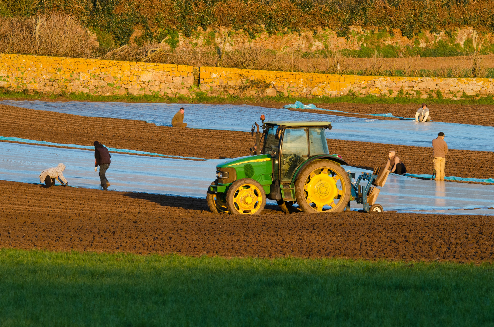

<!-- Banner image — replace with your own -->
<!--  -->

# 🧪 BuildersLab

**A collaborative lab where students & early-career professionals ship real-world AI, ML, and data science projects.**

---

## 🚀 What We Do

| 🤖 AI Applications | 📊 Data Science | 🧠 Machine Learning |
|:------------------:|:---------------:|:-------------------:|
| Build end-to-end AI products | Analyze & visualize real datasets | Train & deploy predictive models |

**4-month program · Team-based · Portfolio-ready projects**

---

## 👥 Meet the Team

<b>🌟 Project Lead</b>

 

| Name | GitHub | Projects |
|------|--------|----------|
| **Nafisat Ibrahim** |  | IEEE-CIS Fraud Detection &nbsp;·&nbsp; Credit Risk Scoring &nbsp;·&nbsp; Agricultural Yield Predictor |

<b>📊 Data Scientists</b>

 

| Name | GitHub | Project |
|------|--------|---------|
| **Bintou Ba** |  | Credit Risk Scoring System |
| **Chiapo Lynda Allepo** |  | Credit Risk Scoring System |
| **Emmanuel N'Guetta** |  | IEEE-CIS Fraud Detection System |
| **Grace Yasmine Bohainan Diagoné** |  | Agricultural Yield Predictor |
| **Laël Keïla Nacro** | <!-- GitHub username unknown --> | IEEE-CIS Fraud Detection System |
| **Marienne Dosso** |  | Credit Risk Scoring System |

<b>⚙️ Machine Learning Engineers</b>

 

| Name | GitHub | Project |
|------|--------|---------|
| **Divyanshi Kashyap** |  | Credit Risk Scoring System |
| **Ephrem Kadja** | <!-- GitHub username unknown --> | Agricultural Yield Predictor |
| **Sai Kotthireddy** | <!-- GitHub username unknown --> | IEEE-CIS Fraud Detection System |

---

## 🗂️ Projects

### 🔍 IEEE-CIS Fraud Detection System

`Fraud Detection` &nbsp;`Classification` &nbsp;`Ensemble Models` &nbsp;`Feature Engineering` &nbsp;`Imbalanced Data`

A machine learning system that identifies fraudulent payment transactions using the IEEE-CIS dataset. The team applies advanced feature engineering, anomaly detection, and ensemble methods to surface suspicious activity with high precision — minimizing false positives while catching real fraud.

 

---

### 💳 Credit Risk Scoring System

`Credit Risk` &nbsp;`Scorecard Modeling` &nbsp;`Logistic Regression` &nbsp;`Financial ML` &nbsp;`Risk Assessment`

A predictive scoring system that evaluates the creditworthiness of loan applicants using historical financial data. The model outputs a continuous risk score to help lenders make data-driven decisions — reducing default rates while keeping credit accessible to qualified borrowers.

 

---

### 🌾 Agricultural Yield Predictor

`Agriculture` &nbsp;`Regression` &nbsp;`Environmental Data` &nbsp;`Food Security` &nbsp;`Geospatial Analysis`

A data-driven forecasting tool that estimates crop yields from environmental and agricultural inputs — including weather patterns, soil composition, and farming practices. Built to help researchers and planners anticipate production outcomes and support more sustainable food systems.

 

---

## 💬 Join the Community

Got questions? Want to collaborate? Come hang out with us!

Built with ❤️ by the BuildersLab team

