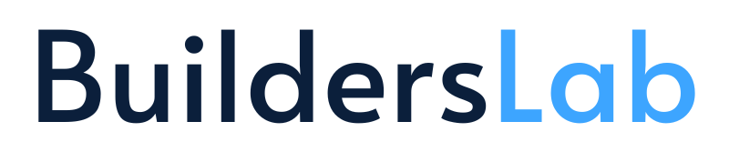

# 🧪 BuildersLab

**A collaborative lab where students & early-career professionals ship real-world AI, ML, and data science projects.**

---

## 🚀 What We Do

| 🤖 AI Applications | 📊 Data Science | 🧠 Machine Learning |
|:------------------:|:---------------:|:-------------------:|
| Build end-to-end AI products | Analyze & visualize real datasets | Train & deploy predictive models |

**4-month program · Team-based · Portfolio-ready projects**

---

## 👥 Meet the Team

<!-- =========================================================
     COHORT UPDATE INSTRUCTIONS
     To add a new cohort:
       1. Copy the entire 
 block below
       2. Change "Cohort 0" to the new cohort number
       3. Update names, GitHub usernames, and projects
     ========================================================= -->

<b>🚀 Cohort 0 &nbsp;·&nbsp; 2026</b>

 

| Name | Role | GitHub | Project |
|------|------|--------|---------|
| **Nafisat Ibrahim** | Project Lead |  | Fraud Detection · Credit Risk · Agri. Yield |
| **Bintou Ba** | Data Scientist |  | Credit Risk Scoring |
| **Chiapo Lynda Allepo** | Data Scientist |  | Credit Risk Scoring |
| **Emmanuel N'Guetta** | Data Scientist |  | Fraud Detection |
| **Grace Y. Bohainan Diagoné** | Data Scientist |  | Agri. Yield Predictor |
| **Laël Keïla Nacro** | Data Scientist | <!-- GitHub username unknown --> | Fraud Detection |
| **Marienne Dosso** | Data Scientist |  | Credit Risk Scoring |
| **Divyanshi Kashyap** | ML Engineer |  | Credit Risk Scoring |
| **Ephrem Kadja** | ML Engineer | <!-- GitHub username unknown --> | Agri. Yield Predictor |
| **Sai Kotthireddy** | ML Engineer | <!-- GitHub username unknown --> | Fraud Detection |

---

## 🗂️ Projects

### 🔍 IEEE-CIS Fraud Detection System

`Fraud Detection` &nbsp;`Classification` &nbsp;`Ensemble Models` &nbsp;`Feature Engineering` &nbsp;`Imbalanced Data`

A machine learning system that identifies fraudulent payment transactions using the IEEE-CIS dataset. The team applies advanced feature engineering, anomaly detection, and ensemble methods to surface suspicious activity with high precision - minimizing false positives while catching real fraud.

 

---

### 💳 Credit Risk Scoring System

`Credit Risk` &nbsp;`Scorecard Modeling` &nbsp;`Logistic Regression` &nbsp;`Financial ML` &nbsp;`Risk Assessment`

A predictive scoring system that evaluates the creditworthiness of loan applicants using historical financial data. The model outputs a continuous risk score to help lenders make data-driven decisions - reducing default rates while keeping credit accessible to qualified borrowers.

 

---

### 🌾 Agricultural Yield Predictor

`Agriculture` &nbsp;`Regression` &nbsp;`Environmental Data` &nbsp;`Food Security` &nbsp;`Geospatial Analysis`

A data-driven forecasting tool that estimates crop yields from environmental and agricultural inputs - including weather patterns, soil composition, and farming practices. Built to help researchers and planners anticipate production outcomes and support more sustainable food systems.

 

---

## 🌱 Want to Be Part of the Next Cohort?

**BuildersLab is looking for curious, driven people who want to do more than just learn - they want to build.**

Whether you're a student, a career switcher, or someone who's been meaning to start that ML project forever, this is your place. You'll work in a real team, on a real project, and walk away with something you're proud to show.

> *"The best way to learn data science is to actually do data science."*

### What you'll get
- 🤝 A team that pushes you forward
- 🛠️ Hands-on experience with real datasets and real problems
- 📁 A portfolio project you built from scratch
- 🌐 A network of builders across the cohort

### Who we're looking for
- Python experience (you don't need to be an expert)
- Curiosity and willingness to figure things out
- Consistency - showing up matters more than being the smartest in the room

 

---

## 💬 Join the Community

Got questions? Want to see what we're building? Come hang out - our Discord is open to everyone.

Built with ❤️ by the BuildersLab team

